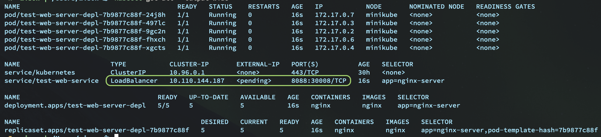

# `Kubernetes` Tutorial

[1. What is `Kubernetes`](#1-what-is-kubernetes)</br>
[2. Installation](#2-installation)</br>
[3. Start your local k8s minikube cluster](#3-start-your-local-k8s-minikube-cluster)</br>
[4. Concepts and components](#4-concepts-and-components)</br>

[5. Basic `kubectl` commands](#5-basic-kubectl-commands)</br>
[5.1 Concept about the layer abstraction](#51-concept-about-the-layer-abstraction)</br>
[5.2 Deployment CRUD](#52-deployment-crud)</br>
[5.2.1 Create deployment](#521-create-deployment)</br>
[5.2.2 List deployment/replicaset/pod info](#522-list-deploymentreplicasetpod-info)</br>
[5.2.3 List extra info for deployment/replicaset/pod](#523-list-extra-info-for-deploymentreplicasetpod)</br>
[5.2.4 Edit deployment](#524-edit-deployment)</br>
[5.2.5 Delete deployment](#525-delete-deployment)</br>
[5.3 Logging](#53-logging)</br>
[5.4 Debugging pods](#54-debugging-pods)</br>

[6. Manage deployment and service by configuration file](#6-manage-deployment-and-service-by-configuration-file)</br>
[6.1 Let's try to deploy the nginx case via configuration file](#61-lets-try-to-deploy-the-nginx-case-via-configuration-file)</br>
[6.2 Comparisons between `Docker Swarm` and `Kubernetes` for deploying cluster](#62-comparisons-between-docker-swarm-and-kubernetes-for-deploying-cluster)</br>

## 1. What is `Kubernetes`
It's a container orchestration tool developed by Google. It helps you to manage your containerized
applications in different deployment environments.

By the way, if you’re wondering where the name “Kubernetes” came from, it is a Greek word, 
meaning helmsman or pilot. 

The abbreviation `K8s` is derived by replacing the eight letters of “ubernete” with the digit 8.

</br>


## 2. Installation

`minikube` is local Kubernetes, focusing on making it easy to learn and develop for Kubernetes.
Basically, `minikube` is a kubernetes cluster run in your local machine (single node case). It
includes the 4 `master` processes and 3 `worker` processes in your single-node cluster environment.

```bash
# HyperKit is an open-source hypervisor for macOS hypervisor, optimized for lightweight
# virtual machines and container deployment.
#
# If Docker for Desktop is installed, you already have HyperKit!!!
brew install hyperkit

brew install minikube
```

As the `kubernetes CLI` is the dependency for `minikube`, so you don't need to install
`kubernetes CLI` separated.

If you see the error below, that means you've already had the prev/older version of `kubernetes CLI`:


```bash
Error: The `brew link` step did not complete successfully
The formula built, but is not symlinked into /usr/local
Could not symlink bin/kubectl
Target /usr/local/bin/kubectl
```

Then you can overwrite it manually like this:

```bash
# Remove the old binary link and relink to the newly installed version
sudo rm -rf /usr/local/bin/kubectl
brew link --overwrite kubernetes-cli
# Linking /usr/local/Cellar/kubernetes-cli/1.21.0... 225 symlinks created.

# Check the version to make sure link correctly
kubectl version
# Client Version: version.Info{Major:"1", Minor:"21", GitVersion:"v1.21.0", GitCommit:"cb303e613a121a29364f75cc67d3d580833a7479", GitTreeState:"clean", BuildDate:"2021-04-08T21:14:14Z", GoVersion:"go1.16.3", Compiler:"gc", Platform:"darwin/amd64"}
# The connection to the server localhost:8080 was refused - did you specify the right host or port?
```

</br>

## 3. Start your local k8s minikube cluster

By default, `minikube` uses the `hyperkit` driver with a pre-installed docker, that's you don't need to install
`Docker Dekstop` to run `minikube`.

```bash
minikube start

# 😄  minikube v1.20.0 on Darwin 10.14.6
# ✨  Automatically selected the hyperkit driver. Other choices: virtualbox, ssh
# 💾  Downloading driver docker-machine-driver-hyperkit:
#     > docker-machine-driver-hyper...: 65 B / 65 B [----------] 100.00% ? p/s 0s
#     > docker-machine-driver-hyper...: 10.52 MiB / 10.52 MiB  100.00% 15.81 MiB
# 🔑  The 'hyperkit' driver requires elevated permissions. The following commands will be executed:
# 
#     $ sudo chown root:wheel /Users/wison/.minikube/bin/docker-machine-driver-hyperkit
#     $ sudo chmod u+s /Users/wison/.minikube/bin/docker-machine-driver-hyperkit
# 
# 
# Password:
# 💿  Downloading VM boot image ...
#     > minikube-v1.20.0.iso.sha256: 65 B / 65 B [-------------] 100.00% ? p/s 0s
#     > minikube-v1.20.0.iso: 245.40 MiB / 245.40 MiB  100.00% 57.09 MiB p/s 4.5s
# 👍  Starting control plane node minikube in cluster minikube
# 💾  Downloading Kubernetes v1.20.2 preload ...
#     > preloaded-images-k8s-v10-v1...: 491.71 MiB / 491.71 MiB  100.00% 40.62 Mi
# 🔥  Creating hyperkit VM (CPUs=2, Memory=6000MB, Disk=20000MB) ...
# 🐳  Preparing Kubernetes v1.20.2 on Docker 20.10.6 ...
#     ▪ Generating certificates and keys ...
#     ▪ Booting up control plane ...
#     ▪ Configuring RBAC rules ...
# 🔎  Verifying Kubernetes components...
#     ▪ Using image gcr.io/k8s-minikube/storage-provisioner:v5
# 🌟  Enabled addons: storage-provisioner, default-storageclass
# 🏄  Done! kubectl is now configured to use "minikube" cluster and "default" namespace by default
```

</br>

## 4. Concepts and components


- Node: The physical or virtual machine for running kubernetes cluster.
    - Master Node: Manage all the worker node to run all pods, 4 processes below must
    in every master node:
        - API server: The k8s cluster gateway to let the outside world interact with the cluster.
        - Scheduler: Decide run pod on the particular worker node based on the resource usage (CPU, MEM, et).
        - Control manager: Detect cluster state change and recover by talking with the Scheduler.
        - etcd: Key-value store for the cluster state.

    </br>

    - Worker Node: The real node to run pods (container instances), 3 processes below must
    in every worker node:
        - kubelet: It interacts with both nodes and containers and starts the container.
        - Kube proxy: Forward the request from service to pod.
        - Container runtime: To run the actual container instance.

</br>


- Pod:
    - Smallest unit in k8s
    - Abstraction of container
    - Usually 1 application container per pod
    - Each pod has a new IP address when created

    </br>

- Service:
    - Service has permanent IP address which the pod doesn't
    - Service has load-balancing feature to forward the request to the particular pod cross
    different worker node
    - Service type:
        - Internal Service: Can't be accessed from the outside world, like Database service
        - External Service: Can be accessed from the outside world, like application service

    </br>

- Ingress: Work like a load-balancer to forward request to the particular service

- ConfigMap: Just like a bunch of environment vars that can be applied to the pod application
like IP and port or any application settings.

- Secret: The same thing as `ConfigMap` but be encrypted, good for password, database URI or any
credential setting for the application.

- Volumes: The persistent data storage that be mounted into the service or pod.


</br>

## 5. Basic `kubectl` commands

#### 5.1 Concept about the layer abstraction

    `Deployment` -- manages --> `Replica set` -- manages --> `Pod` -- abstraction of --> `Container (instance)`
    
    That's why you only need to deal with the `Deployment` as an administrator, no need to interact with the `replicaset and `pod`.

    One thing need to know about is the `StatefulSet` which different with the `Replicaset`. For database,
    it can't be replicated, as all copies should use the same storage. That's why for the database application,
    you should use the `StatefulSet` instead of the `Replicaset`. But in practice, the best choice is by using
    the original database cluster service rather than config by yourself in your k8s cluster.

</br>


#### 5.2 Deployment CRUD

##### 5.2.1 Create deployment

```bash
kubectl create deployment test-web-server-depl --image=nginx --replicas=3 --port=80
# deployment.apps/test-web-server-depl created
```

</br>

##### 5.2.2 List deployment/replicaset/pod info

```bash
kubectl get deployment --output=wide
# NAME                   READY   UP-TO-DATE   AVAILABLE   AGE     CONTAINERS   IMAGES   SELECTOR
# test-web-server-depl   3/3     3            3           5m49s   nginx        nginx    app=test-web-server-depl

kubectl get replicaset --output=wide
# NAME                              DESIRED   CURRENT   READY   AGE     CONTAINERS   IMAGES   SELECTOR
# test-web-server-depl-79d6c8b8b4   3         3         3       5m54s   nginx        nginx    app=test-web-server-depl,pod-template-hash=79d6c8b8b4

kubectl get pod --output=wide
# NAME                                    READY   STATUS    RESTARTS   AGE   IP           NODE       NOMINATED NODE   READINESS GATES
# test-web-server-depl-79d6c8b8b4-dlvpc   1/1     Running   0          6m    172.17.0.4   minikube   <none>           <none>
# test-web-server-depl-79d6c8b8b4-fj874   1/1     Running   0          6m    172.17.0.3   minikube   <none>           <none>
# test-web-server-depl-79d6c8b8b4-xg65c   1/1     Running   0          6m    172.17.0.5   minikube   <none>           <none>
```

- The `--output=[format]` option supports `json/yaml/wide`
- The `--no-headers` doesn't print the header row

</br>

As you can see above the `naming convention` would look like below:

`[deployment name]-[replicaset name]-[pod name]` 

If you don't specified the `name`, then random id will be generated like below:

`test-web-server-depl-79d6c8b8b4-xg65c`

</br>

##### 5.2.3 List extra info for deployment/replicaset/pod

Sometimes, it's very useful to know the deployment scales history, then you use `kubectl describe deployement`:

```bash
kubectl describe deployment test-web-server-depl

# Name:                   test-web-server-depl
# Namespace:              default
# CreationTimestamp:      Mon, 17 May 2021 17:08:21 +1200
# Labels:                 app=test-web-server-depl
# Annotations:            deployment.kubernetes.io/revision: 1
# Selector:               app=test-web-server-depl
# Replicas:               5 desired | 5 updated | 5 total | 3 available | 2 unavailable
# StrategyType:           RollingUpdate
# MinReadySeconds:        0
# RollingUpdateStrategy:  25% max unavailable, 25% max surge
# Pod Template:
#   Labels:  app=test-web-server-depl
#   Containers:
#    nginx:
#     Image:        nginx
#     Port:         80/TCP
#     Host Port:    0/TCP
#     Environment:  <none>
#     Mounts:       <none>
#   Volumes:        <none>
# Conditions:
#   Type           Status  Reason
#   ----           ------  ------
#   Progressing    True    NewReplicaSetAvailable
#   Available      False   MinimumReplicasUnavailable
# OldReplicaSets:  <none>
# NewReplicaSet:   test-web-server-depl-79d6c8b8b4 (5/5 replicas created)
# Events:
#   Type    Reason             Age   From                   Message
#   ----    ------             ----  ----                   -------
#   Normal  ScalingReplicaSet  57s   deployment-controller  Scaled up replica set test-web-server-depl-79d6c8b8b4 to 3
#   Normal  ScalingReplicaSet  4s    deployment-controller  Scaled up replica set test-web-server-depl-79d6c8b8b4 to 5
```

Also, extra info for the particular pod:


```bash
kubectl describe pod test-web-server-depl-79d6c8b8b4-5tnhv

# Name:         test-web-server-depl-79d6c8b8b4-5tnhv
# Namespace:    default
# Priority:     0
# Node:         minikube/192.168.64.2
# Start Time:   Mon, 17 May 2021 17:09:14 +1200
# Labels:       app=test-web-server-depl
#               pod-template-hash=79d6c8b8b4
# Annotations:  <none>
# Status:       Running
# IP:           172.17.0.7
# IPs:
#   IP:           172.17.0.7
# Controlled By:  ReplicaSet/test-web-server-depl-79d6c8b8b4
# Containers:
#   nginx:
#     Container ID:   docker://c6d39c2319a2a4f945898124bc70b2aa2d850ca52dcb4c82a2e952e57674587f
#     Image:          nginx
#     Image ID:       docker-pullable://nginx@sha256:df13abe416e37eb3db4722840dd479b00ba193ac6606e7902331dcea50f4f1f2
#     Port:           80/TCP
#     Host Port:      0/TCP
#     State:          Running
#       Started:      Mon, 17 May 2021 17:09:18 +1200
#     Ready:          True
#     Restart Count:  0
#     Environment:    <none>
#     Mounts:
#       /var/run/secrets/kubernetes.io/serviceaccount from default-token-x5j2b (ro)
# Conditions:
#   Type              Status
#   Initialized       True
#   Ready             True
#   ContainersReady   True
#   PodScheduled      True
# Volumes:
#   default-token-x5j2b:
#     Type:        Secret (a volume populated by a Secret)
#     SecretName:  default-token-x5j2b
#     Optional:    false
# QoS Class:       BestEffort
# Node-Selectors:  <none>
# Tolerations:     node.kubernetes.io/not-ready:NoExecute op=Exists for 300s
#                  node.kubernetes.io/unreachable:NoExecute op=Exists for 300s
# Events:
#   Type    Reason     Age   From               Message
#   ----    ------     ----  ----               -------
#   Normal  Scheduled  3m6s  default-scheduler  Successfully assigned default/test-web-server-depl-79d6c8b8b4-5tnhv to minikube
#   Normal  Pulling    3m5s  kubelet            Pulling image "nginx"
#   Normal  Pulled     3m2s  kubelet            Successfully pulled image "nginx" in 2.599375714s
#   Normal  Created    3m2s  kubelet            Created container nginx
#   Normal  Started    3m2s  kubelet            Started container nginx
```

Same thing, you can describe all resources:

```bash
kubectl describe nodes
kubectl describe deployments
kubectl describe pods
```

</br>

##### 5.2.4 Edit deployment

```bash
kubectl edit deployment test-web-server-depl
```

After that, it opens the live configuration file inside your default editor. Then you can change it and save it,
`kubernetes` make sure update to the new state you desired.


</br>


##### 5.2.5 Delete deployment

```bash
kubectl delete deployment test-web-server-depl
```

</br>

#### 5.3 Logging

- View only one container logging with the exactly pod name:

    ```bash
    # `--follow` live update
    kubectl logs test-web-server-depl-6dfb46c84f-8ngz2 --follow
    ```


- View all container logs with live update

    ```bash
    # `--selector` use for querying and filtering
    kubectl logs --selector=app=test-web-server-depl --all-containers --follow
    ```

    </br>

#### 5.4 Debugging pods

You can login into the particular pod container instance to have a look by running:

```bash
# `test-web-server-depl-6dfb46c84f-6l5hj` is the [pod name]
kubectl exec -it test-web-server-depl-6dfb46c84f-6l5hj -- bin/bash
```


</br>


## 6. Manage deployment and service by configuration file

Here is the convenience way to manage the cluster:

| Command | Purpose
|--------------|---------------
|`kubectl apply --filename [configuration file name]` | create, edit deployment and service
|`kubectl delete --filename [configuration file name]` | destroy deployment and service

`kubernetes` make sure the actual state will be the same as the desired state eventually. If some pods are
terminated, then new pods will be created which work like a self-healing.

</br>

#### 6.1 Let's try to deploy the nginx case via configuration file

- Below is the sample configuration file in `~/temp/temp-config.yaml`:

    ```yaml
    apiVersion: apps/v1
    kind: Deployment
    metadata:
        name: test-web-server-depl
        labels:
            app: nginx-server
    
    # Specification for the deployment
    spec:
        replicas: 5
        selector:
            # `labels` uses to be connected between deployment and pod
            matchLabels:
                app: nginx-server
    
        # `template` just an embedded config for the pod, it has its
        # own `metadata` and `spec` but only focusing on the pod.
        template:
            metadata:
                labels:
                    app: nginx-server
    
            # Specification for the pod
            spec:
                containers:
                - image: nginx
                  imagePullPolicy: Always
                  name: nginx
                  ports:
                  - containerPort: 80
                    protocol: TCP
                restartPolicy: Always
                terminationGracePeriodSeconds: 5
    
    # The separator line for multiple configration contents in the same YAML file
    ---
    
    # The external service to expose the port to outside world for accessing the pod's
    # open port.
    apiVersion: v1
    kind: Service
    metadata:
        name: test-web-service
    spec:
        # Service is `internal` by default which means only can be accessed inside the 
        # kubernetes cluster component. `type: LoadBalancer` means that's an `external`
        # service that can be accessed from the outside world.
        #
        # Btw, even the service is an `internal` service, it still works as a load
        # balancer. So the name of `LoadBalancer` is quite confuse sometimes:)
        type: LoadBalancer
    
        # Service use this `selector` to connect to the pod through the `label` in the
        # pod's `template --> metadata --> labels`. The case here means this service
        # should connect the pod which has the label value with `app=nginx-server`
        selector:
            app: nginx-server
        ports:
            # Mapping service port 8088 to the pod's open port 80 on TCP
            - protocol: TCP
              port: 8088
              targetPort: 80
              # Optional field
              # By default and for convenience, the Kubernetes control plane will 
              # allocate a port from a range (default: 30000-32767)
              nodePort: 30008
    ```

    </br>

- Create the deployment and service

    ```bash
    kubectl apply --filename ~/temp/temp-config.yaml
    
    # deployment.apps/test-web-server-depl created
    # service/test-web-service created


    kubectl get all --output=wide
    ```

    

    What the configration file above is asking for:

    - Create a deployment with 5 replicas for nginx pod, each nginx pod open port on `80`.
    - Create a external service for exposing the pod's open port, like a forward mapping between service and pod on `8088 -> 80`
    - `nodePort` means the listening port on the external IP 
    - Echo service has the `Cluster-IP` which is the `internal IP`, only the `external service`
    has the `EXTERNAL-IP`.

    </br>

    If you run `minikube service list` then you should be able to see the list like below:

    

    Then you can access the nginx service via `http://192.168.64.2:30008` in your browser.

    You can edit your configration file anytime and re-run the command again, kubernetes will
    updated the actual state to the desired state automatic.

    The actual HTTP request network route should look like below:

    `Browser request -> external service IP:port (192.168.64.2:30008) -> servcie to pod mapping (30008 -> 8088 -> 80) -> ngix container port (80)`

    </br>


- Destroy the deployment and service

    ```bash
    kubectl delete --filename ~/temp/temp-config.yaml

    # deployment.apps "test-web-server-depl" deleted
    # service "test-web-service" deleted
    ```

    </br>


#### 6.2 Comparisons between `Docker Swarm` and `Kubernetes` for deploying cluster

If you compare to the `Docker Swarm`, here is the command comparison list:

| Docker Swarm | Kubernetes
|--------------|---------------
|# Start/update cluster </br>docker stack deploy --compose-file [filename] | # Start/update cluster </br> kubectl apply --filename [filename]
|# Stop cluster </br>docker stack rm [stack name] | # Stop cluster </br> kubectl delete --filename [filename]

</br>

